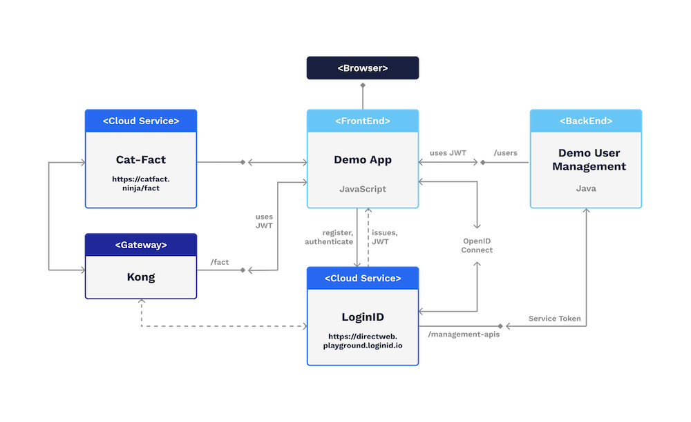
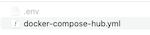

# LoginID-Tutorial

This tutorial simulates a small setup that includes these components:

- **Demo App**:
  - A simple web application that leverages our javascript libraries for FIDO2 based user registration and authentication
  - The app demos several features and flows
  - The app demos the usage of the LoginID provided Kong gateway plugin
- **Kong**:
  - A Docker version of the Kong API Gateway
  - Kong is configured to validate a LoginID issued JWT and return an error if not provided or invalid
  - The tutorial connects to the public service Cat-Fact, once as an open API call, once protected by Kong
- **User Management**:
  - Simulates a simple user management API. It receives a LoginID issued JWT and ... returns the username
  - Connects to LoginID to call LoginID APIs that require so-called *service token*
- **OpenID Connect**
  - A simple Single-Page App client demonstrates the usage of LoginIDs OpenID Connect flow

The tutorial setup looks like this:

FrontEnd, BackEnd and Gateway are implemented as Docker images!

## Options for using this tutorial

There are multiple options for using this tutorial:

- **preferred for non-developers**, follow these steps:
  - *Preparing the tutorial*
  - *Running the tutorial*
  - Only **Docker** needs to be installed!
- **preferred for developers**, follow all steps below

## Cloning this project

This project uses the LoginID-Java-SDK which is used as a git submodule. When cloning this project, use this command:

- `git clone --recurse-submodules https://github.com/loginid1/loginid-tutorial.git`

To continue, cd into `./loginid-tutorial`.

If you ran git clone without `--recurse-submodules` or if you are not working in the main branch, run the following now:

- `git submodule init`
- `git submodule update`

Your project now includes the submodule that contains the java SDK but only as a *read* version, so to say.

**Tip:** More information on git submodules can be found [here](https://git-scm.com/book/en/v2/Git-Tools-Submodules).

## Preparing the tutorial

### Create client credentials

To use this tutorial locally visit [LoginIDs dashboard](https://playground.loginid.io/) and register.

In the dashboard create two required applications (*Applications - Add Application*):

- `Web App`
  - register an **Application Name** and a **Website URL**
  - use **http://localhost** for the URL
  - do **NOT** attach an API Credential
- `Backend/API`
  - register an **Application Name** and a **Website URL**
  - use **http://localhost** for the URL
  - attach an API Credential
- Optional: `OpenID Connect (OIDC)`
  - register an **Application Name** and a **Redirect URI(s)**
  - use **http://localhost/oidc.html** as redirect_uri
  - select **Email** as an additional SCOPE
  - select **Client Type = Public**
  - Select **Next** and take note of the shown endpoint *OpenID configuration endpoint*
  - do **NOT** attach an API Credential
  - **Tip:** More details about this client type can be found [here](https://docs.loginid.io/coming-soon):

### Configure the tutorial

Copy the above file `.env_template` and paste it as `.env`.

The following values need to be updated in `.env`:

- `CLIENT_ID_BACKEND`: use the client ID of the Backend application
- `API_PRIVATE_KEY`: use the Api Credential (you do not need to maintain the **\n** characters, but it needs to be one single line)
- `CLIENT_ID_WEB`: use the client ID of the Web application
- `OIDC_PUBLIC_CLIENT_ID`: configure the OpenID Connect client_id (optional, if an OIDC client was registered)
- `OIDC_CONFIG_ENDPOINT`: configure this endpoint using the value that was shown after registering the OpenID Connect application (optional, if an OIDC client was registered)
- `BASE_URL`: verify the value. It most likely does not need to be updated
- `HOSTNAME`: update this variable if the tutorial is not running at *http://localhost*
  - i.e.: from *http://localhost* to *https://mydomain.com*

Please find more details within that file!

## Building the tutorial

### Prepare the build

The whole system is docker based. To build it these tools are needed:

- docker
- docker-compose
- Make
  - if Make is not available, run the commands found within `Makefile` manually in your terminal

### Build the containers

After completing the previous step, do this:

- once:
  - `make build_tooling`
  - this will build a container that includes java jdk11, maven and the compiled LoginID java SDK. This only needs to be executed for the first time or after an update of the java SDK!
  - **Tip**: if this fails, verify that you followed the instructions above at **Cloning this project**!
- always:
  - for Mac: `make build`
    - this compiles code and builds the docker images
  - for Windows: `make build_win`
    - run this if you are on a Windows machine
    - please look into **Makefile** for details if you do not want to use Make or if failures occur

**Tip:** for Windows related issues, please check the repositories **[WIKI](https://github.com/loginid1/loginid-tutorial/wiki)** pages!

## Running the tutorial

#### Launch pre-built tutorial

- copy and paste the above file `docker-compose-hub.yml`
  - make sure it is in the same directory as `.env` that was created at **Preparing the tutorial**
  - just like this: 
- in a terminal, run: `docker-compose -f docker-compose-hub.yml up`
  - this launches the system by pulling the images from hub.docker.io

#### Launch the locally built tutorial

After building the project you are ready to launch the system:

- `docker-compose up`
  - this launches the system

### Access the tutorial

- `http://localhost`
  - open a browser at that location and enjoy the app
  - these ports will be used: **80, 8090**

### Stopping the tutorial

Once you are done, terminate the containers by running:

- `docker-compose down`
- `docker-compose -f docker-compose-hub.ym down` // for the pre-built tutorial 

**Tip:** if you run into trouble when launching docker because it complains about conflicting containers already running, use this command to stop and remove them:

- `docker stop $(docker ps -aq)`
- `docker rm $(docker ps -aq)`

### For developers: Debugging code

To debug java code do the following:

- run `docker-compose -f docker-compose-dev.yml up`  // use this instead of `docker-compose up`
- use java remote debugging on port 8000 (for more details see **JAVA_OPTS** in the compose file)

You can now set breakpoints in the code of the UserMgmt module.

## Additional Info

Whenever you register and use a username when authenticating, you can find that name in the user management UI of the LoginID dashboard.

Users are only visible within the namespace of your LoginID account.

### Tutorial details

The application uses the LoginID issued JWT as its session token and when authenticating users against the user management API.
For this tutorial the JWT is stored in the session store of the browser.

Try out the different menus to learn more about LoginID features!

### Kong Plugin configuration

The Kong plugin configuration can be updated in this file:
 
- `./docker-build/add-ons/kong/kong.yml`
  - find the section called: **plugins - loginid**

The following values may be configured:

|Parameter|Description|Type|Required|
|---------|-----------|----|--------|
|login_id_base_url|The base URL as given by LoginID|String|X|
|login_id_client_id|The client_id as given by LoginID|String|X|
|login_id_public_key_url|LoginID public key retrieval URL|String|X|
|issuer|Expected issuer of the JWT. This value will be validated against **iss** value in JWT payload. Defaults to **loginid.io**|String|-|
|audience|Expected audience. This value will be validated against **aud** value in JWT payload|String|X|
|maximum_age|Expected max. age in seconds. Default value is 300 seconds. Difference between current time and **
iat** value in JWT payload need to be below this max age|Number|-|
|acr|Expected acr value. This value will be validated if the acr value is configured in the plugin. If not, this value will not be validated|String|-|
|algorithm|Expected signing algorithm. Default value is ES256. This value will be validated against **alg** value in JWT header|String|-|
|namespace_id|Expected namespace ID. This value will be validated against nid value in JWT payload|String|-|

**Note**: By default no manual changes are needed. The file will be updated according to settings in **.env**.

### Learn more

To learn more about this tutorial, please check the repositories **[WIKI](https://github.com/loginid1/loginid-tutorial/wiki)** pages!

## Links

- To learn more about LoginID please visit: [https://loginid.io](https://loginid.io)
- To view the developer documentation start here: [Dev @ LoginID](https://docs.loginid.io)
- More examples can be found here on GitHub: [LoginID @ GitHub](https://github.com/loginid1)