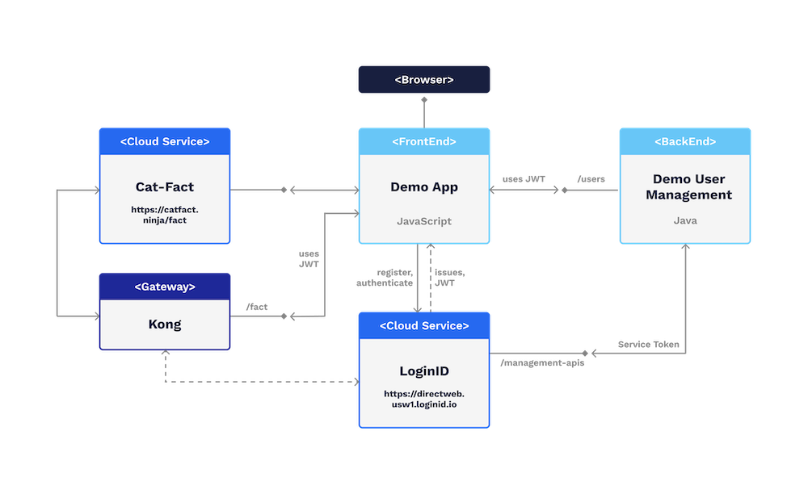

# Demo

This demo simulates a small setup that includes these components:

- **Demo App**:
  - a simple web application that leverages our javascript libraries for FIDO2 based user registration and authentication
  - the app can be used to call the Cat-Fact API directly or via Kong
  - if called via Kong a user may have to authenticate against LoginID
- **Kong**:
  - a Docker version of the Kong API Gateway
  - Kong is configured to validate a LoginID issued JWT and return an error if not provided or invalid
- **User Management**:
  - simulates a simple user management API. It receives a LoginID issued JWT and ... returns the username
- **Cat-Fact**:
  - a simple, publicly available service that returns facts about cats. It is used simply because it is available

The visual version of the setup looks like this:

## Preparing the demo

To make it work you have to register a **Web App** at LoginIDs dashboard.

Once that is done, update the following files:

- `./docker-compose.yml, ./docker-compose-dev.yml`
  - in both files update **BASE_URL** if needed
  - the second file runs the *user management* container with remote debugging enabled on port 8000
  - the user management container uses the BASE url to retrieve the public signing cert of LoginID
- `./web/authenticate.html`
  - update the BASE_URL and client_id within the constructor of the SDK (e.g.: `const dw = new web.default\("https://directweb.usw1.loginid.io", "pW2GlAFMYRgHRa0CGMT....)`
- `./docker-build/add-ons/kong/kong.yml`
  - update **login_id_base_url**, **login_id_client_id**, **login_id_public_key_url** and **audience** of the plugin
  - usually *audience* will match the client_id

### Plugin configuration

For your convenience, these values may be configured for the plugin:

|Parameter|Description|Type|Required|
|---------|-----------|----|--------|
|login_id_base_url|The base URL as given by LoginID|String|X|
|login_id_client_id|The client_id as given by LoginID|String|X|
|login_id_public_key_url|LoginID public key retrieval URL|String|X|
|issuer|Expected issuer of the JWT. This value will be validated against **iss** value in JWT payload. Defaults to **loginid.io**|String|-|
|audience|Expected audience. This value will be validated against **aud** value in JWT payload|String|X|
|maximum_age|Expected max. age in seconds. Default value is 300 seconds. Difference between current time and **
iat** value in JWT payload need to be below this max age|Number|-|
|acr|Expected acr value. This value will be validated if the acr value is configured in the plugin. If not, this value will not be validated|String|-|
|algorithm|Expected signing algorithm. Default value is ES256. This value will be validated against **alg** value in JWT header|String|-|
|namespace_id|Expected namespace ID. This value will be validated against nid value in JWT payload|String|-|

## Building the demo

The whole system is docker based. To build it these tools are needed:

- maven
- java
- Make  // if you do not have Make, run the commands found within `Makefile` manually
- docker
- docker-compose

If all those are available, do this:

- `make build`  // this compiles code and build the docker images
- `docker-compose up`  // this launches the system
- `http://localhost`  // open a browser at that location and follow the prompts
- when authenticating, choose a username of you choice (which is hopefully not taken)

To view user flows, open this page:

- `http://localhost:3000`

## Note

The demo was not build to show off a perfect implementation but to show that the Kong plugin works and to be able to run through a simple user flow!